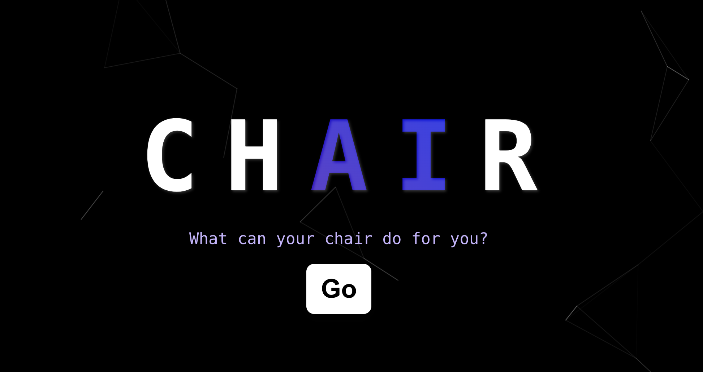

# TreeHacks2024

## Background
Approximately 80% of people will experience back pain at some point in their lives. Poor posture, especially when sitting for long periods, can lead to increased back and neck pain, reduce lung capacity by up to 30%, slow the digestive process, impair circulation, and negatively impact appearance. 
How can we mitigate this issue? Chair is a real-time chair ergonomics analysis platform built on...well, a chair!

## What it does
ChAir integrates pressure sensors on your chair with computer vision to track your posture and notify you when you have poor posture. We display posture analytics on your computer along with natural language feedback on improving your posture.

## How we built it
Hardware: 4 pressure sensors record pressure along various points on you back, on the chair's backing. Each sensor represents a certain part of the spine.  1 webcam finds your body's "skeleton" state.  

Software: We trained a deep neural network Multilayer Perceptron (MLP) to find how hunched you are based on the data from 4 pressure sensors. We used MLP over CNNs due to their increased accuracy on a small data set. MLP processes the data from the four pressure sensors in real time and gives an output of -1 if there is no problem with the posture. If there is an issue, the model outputs 0, 1, 2, or 3 to highlight which part of the spine seems to have the most problem.

To visually represent the measurements of the pressure sensor, we built a 3D model of a spine using Three.js within a React application. This model comprises individual vertebrae represented by cylindrical geometries, which are grouped together to form the entire spine. 

We trained another deep neural network to give a score for back posture, neck posture, and shoulder posture based on data from the MoveNet model, which outputs human skeleton pose data from a video stream. Based on this data, we display analytics on a React website.

Our last component is an LLM that generates suggestions for posture improvements and live sound notifications to remind you to improve your posture.

## Challenges we ran into
We had a lot of trouble integrating all the pieces of this project together on the front end. Getting all the individual pieces together was a challenge.

We tried to use DALL-E, Midjourney, and GAN models to generate pictures that will visualize the results from the pressure sensors. The goal was to highlight the area where the user might be having a medical problem or simply needs to improve their posture. However, due to the nature of these models, we received inconsistency in the outputs. Instead, we decided to design a 3D-rendered spine model.

## Accomplishments that we're proud of

We transformed something as simple as a chair into a healthcare tool that analyzes the front and the back of our posture. In such a short period of time, we integrated a React website, Web Cam, GPT LLM, Pressure Sensors, MLP Model, and a MoveNet Model work to be integrated into one tool. 

## What we learned

**How to sit**:
No, literally! Before jumping to solutions, we had an opportunity to read many different papers and understand the health implications of improper posture. We also had a lot of fun creating our training data for this project, modelling many different types of postures.

**3D Rendering Models**: Learned to connect different components to act as one rotating tool. 

**Importance of Live Feedback**: You can't change what you can't measure. By providing users with immediate feedback on their posture, chAIr helps them make instant corrections, which is crucial for forming good habits. 

**Integration**: We learned how to analyzing integrations between different technologies—from hardware sensors and 3D models to software applications and user interfaces. 

## What's next for Chair

**Expanding Posture Analytics**: We plan to enhance ChAir's analytical capabilities by incorporating more sophisticated algorithms that can predict long-term posture trends and offer personalized improvement plans based on user behavior.

**Integration with Health Apps**: To provide a holistic health management experience, we aim to integrate ChAir with existing health and fitness apps. 

**Broader Ergonomic Assessments**: Expanding beyond just sitting posture, we're exploring ways to assess and improve ergonomic setups at workstations, including desk height, monitor positioning, and keyboard placement, to promote overall body wellness.

**Community and Social Features**: To motivate users further, we're considering adding community challenges and social sharing features, enabling users to share their progress and tips, creating a supportive environment for posture improvement.
